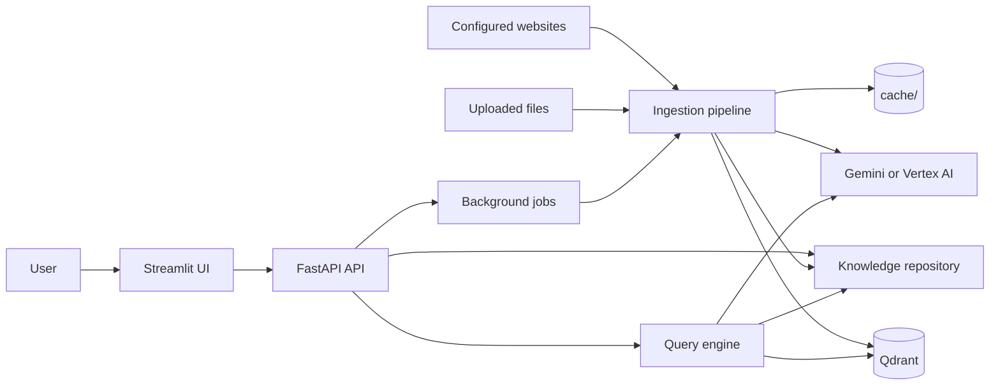
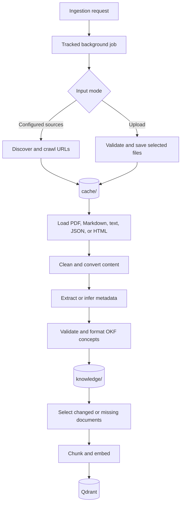
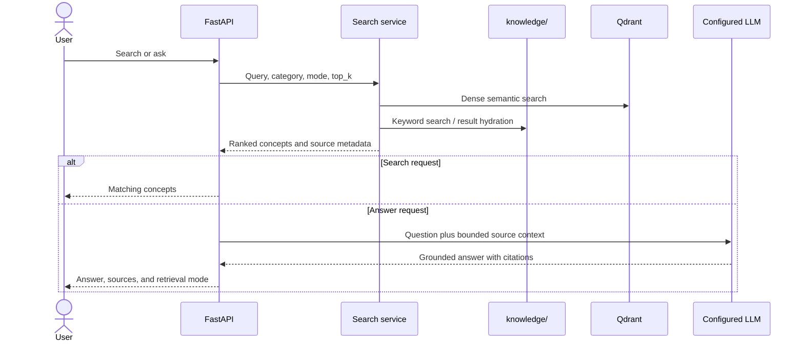

ahve # OKF Platform Architecture

## Purpose

The OKF platform is a retrieval-augmented knowledge assistant. It acquires
documentation, converts it into portable Markdown concepts with structured
metadata, indexes those concepts, and answers questions using retrieved source
material.

The filesystem knowledge repository is authoritative. Qdrant is a generated
retrieval index and can be rebuilt from the repository.

## System context



Docker Compose runs three services:

| Service | Responsibility | Host port |
| --- | --- | --- |
| `ui` | Streamlit user interface | `8501` |
| `api` | HTTP API, job control, ingestion, and queries | `8000` |
| `qdrant` | Dense-vector retrieval index | `6333` |

The model provider is external to the Compose stack. `AI_PROVIDER` selects the
Gemini Developer API or Vertex AI implementation.

## Storage model

```text
cache/                         disposable input and processing state
├── .state/                    crawl, processing, and vector-state records
├── <source>/                  cached pages grouped by crawl source
└── <uploaded files>           raw user uploads

knowledge/                     durable source of truth
└── <category>/<concept>.md    validated OKF concepts

qdrant_storage/                generated local vector index
```

- `cache/` can be removed, but doing so discards downloads and incremental
  ingestion state.
- `knowledge/` should be preserved and versioned. Regeneration can require
  network access and paid model calls.
- `qdrant_storage/` is operational data. If it is lost or the embedding model
  changes, rebuild it from `knowledge/`.

## Ingestion



Configured crawls read `config/sources.yaml`. Upload jobs run in upload-only
mode so an upload does not unexpectedly process unrelated cached files.

The job manager serializes ingestion work, exposes progress, and checks for
cancellation between documents. State files and content hashes support
incremental processing. Before re-indexing a source file, its previous Qdrant
points are removed so repeated ingestion remains idempotent.

Metadata extraction prefers the selected model provider and can infer basic
metadata when model-backed extraction is unavailable. Indexing requires a
working embedding provider and Qdrant.

## Retrieval and answer generation



Search mode `auto` uses semantic retrieval when available and falls back to
filesystem keyword search when it is not. Retrieved previews are hydrated from
the authoritative concept files before answer generation. The prompt requires
the model to use only supplied context and cite source titles.

Qdrant currently uses dense vectors. Sparse vectors are disabled because the
pinned FastEmbed, Qdrant client, and LlamaIndex integration versions have an
incompatible sparse-metadata API. “Hybrid” behavior at the application layer
therefore means semantic retrieval with keyword fallback, not simultaneous
dense/sparse fusion inside Qdrant.

## OKF concept format

Each concept is a Markdown body with YAML frontmatter. The core fields are:

```yaml
---
id: kubernetes-deployment
type: concept
title: Kubernetes Deployment
description: A controller that manages replicated Pods.
category: kubernetes
tags:
  - deployment
  - workload
source:
  name: Kubernetes documentation
  url: https://kubernetes.io/docs/concepts/workloads/controllers/deployment/
---
```

The schema and parsing rules are defined in `app/okf/`. Source metadata flows
through the index and query response so answers can cite original material.

## Component map

| Package | Responsibility |
| --- | --- |
| `app/api/` | FastAPI setup and ingestion, job, query, and concept routes |
| `app/core/` | Settings, provider clients, authentication, and retry policy |
| `app/ingestion/` | Crawling, loading, metadata extraction, status, and orchestration |
| `app/jobs/` | In-process job queue, lifecycle, progress, and cancellation |
| `app/parser/` | Sitemap discovery and HTML cleanup |
| `app/converter/` | Markdown conversion and concept splitting |
| `app/okf/` | Schema, parsing, formatting, and filesystem repository |
| `app/indexing/` | Document conversion, vector-state tracking, and indexing |
| `app/query/` | Search coordination and grounded answer generation |
| `app/retrieval/` | Qdrant and LlamaIndex integration |
| `app/storage/` | Persistent ingestion state |
| `app/ui/` | Streamlit application and visual components |

## Runtime and failure behavior

- API dependency health is reported by `GET /health`; a degraded dependency
  does not make the liveness endpoint itself fail.
- Model calls retry quota and rate-limit failures with exponential backoff.
- A failed document does not abort the entire indexing batch; failures are
  reported and processing continues.
- Search can fall back to the filesystem when semantic retrieval is
  unavailable. Generating an answer still requires a configured LLM.
- Jobs and live progress are in-process state. Restarting the API interrupts
  active jobs, while filesystem and Qdrant data remain persistent.

## Configuration boundaries

Runtime settings are defined in `app/core/config.py` and loaded from environment
variables or `.env`. Crawl definitions live in `config/sources.yaml`. Small,
explicitly sourced context additions used during answer generation live in
`config/context_supplements.yaml`.

Secrets belong only in `.env` or the provider's credential mechanism. They must
not be stored in source configuration, knowledge files, or documentation.
