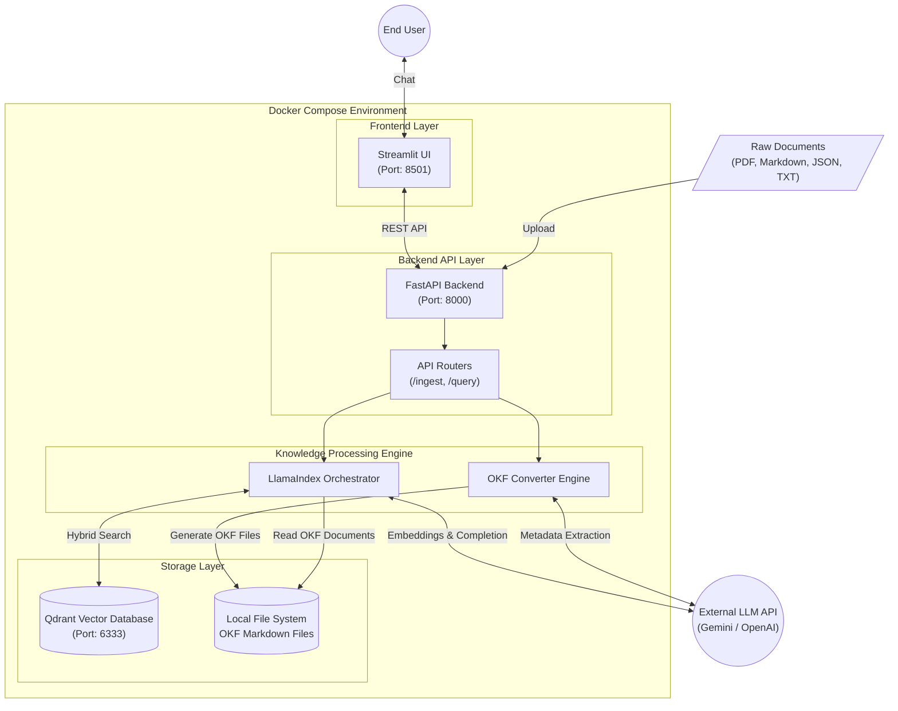
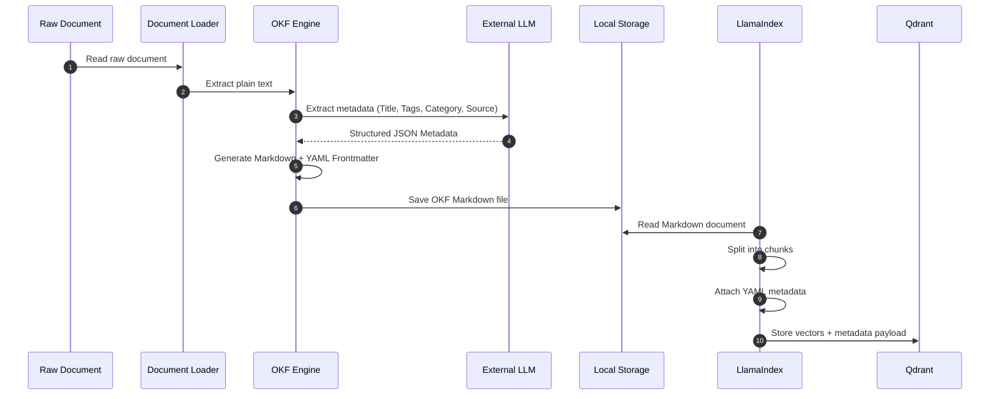

# Open Knowledge Framework (OKF) - System Architecture

This document describes the overall architecture, core components, and end-to-end data flows of the **Open Knowledge Framework (OKF) Enterprise Proof of Concept (PoC)**.

---

# 🏗️ 1. High-Level System Architecture

The application follows a **containerized microservices architecture** using **Docker Compose**, ensuring scalability, modularity, and clear separation of concerns.



---

# 🧩 2. Component Breakdown

| Component | Technology | Purpose |
|------------|------------|---------|
| **Frontend UI** | Streamlit | Provides an interactive conversational interface and renders AI responses along with citation cards. |
| **Backend API** | FastAPI | Exposes REST APIs, validates requests using Pydantic, and orchestrates ingestion and querying workflows. |
| **Data Orchestration** | LlamaIndex | Handles document chunking, prompt generation, embedding creation, retrieval, and communication with the LLM. |
| **OKF Engine** | Custom Python | Converts raw documents into standardized OKF Markdown files with YAML Frontmatter. |
| **Vector Database** | Qdrant | Stores dense embeddings, sparse BM25 vectors, and YAML metadata as searchable payloads. |
| **LLM Provider** | Gemini / OpenAI | Generates metadata during ingestion and produces grounded answers during querying. |
| **Local Storage** | File System | Stores human-readable OKF Markdown files for long-term portability and framework independence. |

---

# 🔄 3. Data Workflows

## 3.1 Knowledge Ingestion Workflow

This workflow transforms raw, unstructured enterprise documents into searchable OKF knowledge.



---

## 3.2 Retrieval & Reasoning Workflow (RAG)

This workflow describes how a user query is answered using **Hybrid Search** and **Retrieval-Augmented Generation (RAG)**.

```mermaid
flowchart TD

    A([User Query])

    B(FastAPI /query)

    C[LlamaIndex Query Engine]

    D[(Qdrant Vector Database)]

    subgraph "Hybrid Search"

        E[Semantic Search]

        F[Keyword Search (BM25)]

        G[Reciprocal Rank Fusion]

        D --> E

        D --> F

        E --> G

        F --> G

    end

    H[Retrieve Top-K OKF Chunks]

    I[Prompt Builder]

    J((LLM))

    K[Generated Answer]

    L[Extract Citations]

    M(FastAPI Response)

    N([Streamlit UI])

    A --> B

    B --> C

    C --> D

    G --> H

    H --> I

    I -->|Context + Citation Instructions| J

    J --> K

    J --> L

    K --> M

    L --> M

    M --> N
```

---

# ⚙️ 4. Knowledge Ingestion Pipeline

The ingestion process converts raw enterprise documents into indexed knowledge.

```text
Raw Documents
      │
      ▼
Document Loader
      │
      ▼
Text Extraction
      │
      ▼
Metadata Extraction (LLM)
      │
      ▼
OKF Formatter
      │
      ▼
Markdown + YAML Frontmatter
      │
      ▼
Save to Knowledge Directory
      │
      ▼
Chunking
      │
      ▼
Embedding Generation
      │
      ▼
Hybrid Indexing
      │
      ▼
Qdrant
```

---

# 🔍 5. Query Processing Pipeline

```text
User Question
      │
      ▼
FastAPI API
      │
      ▼
Embedding Generation
      │
      ▼
Hybrid Search
(Dense + BM25)
      │
      ▼
Reciprocal Rank Fusion
      │
      ▼
Top-K OKF Chunks
      │
      ▼
Prompt Construction
      │
      ▼
Large Language Model
      │
      ▼
Grounded Answer
      │
      ▼
Citation Mapping
      │
      ▼
Streamlit UI
```

---

# 🏛️ 6. Key Design Decisions

## 1. Physical Knowledge Storage

Instead of storing documents only inside a vector database, every document is converted into a standardized **OKF Markdown file** before indexing.

**Benefits**

- Human-readable knowledge
- Version control with Git
- Vendor independence
- Long-term portability
- Easy auditing

---

## 2. Hybrid Search

Enterprise documentation frequently contains:

- Error codes
- Kubernetes resource names
- Version numbers
- Acronyms
- API identifiers

Dense embeddings alone often struggle with these exact-match terms.

The system combines:

- Semantic Vector Search
- Sparse BM25 Search

using **Reciprocal Rank Fusion (RRF)** to improve retrieval quality.

---

## 3. Strict Citation Enforcement

Every generated answer must reference the originating OKF document using its YAML metadata.

The prompt instructs the LLM to:

- Answer only from retrieved context.
- Include document citations.
- Never fabricate missing information.
- Respond with **"I cannot answer this based on the available knowledge."** when the context is insufficient.

---

## 4. Metadata-Driven Retrieval

Each document chunk inherits YAML metadata including:

- Title
- Category
- Tags
- Source
- Author
- Last Updated

This enables:

- Metadata filtering
- Better search precision
- Rich citation cards
- Improved traceability

---

## 5. Evaluation-Driven Development

The solution integrates **Ragas** to continuously evaluate:

- Faithfulness
- Answer Correctness
- Context Recall
- Context Precision
- Hallucination Rate

This ensures the system consistently meets enterprise accuracy requirements before deployment.

---

# 🚀 Overall Architecture Summary

```text
                 +------------------------+
                 |      Streamlit UI      |
                 +-----------+------------+
                             |
                             |
                             ▼
                 +------------------------+
                 |      FastAPI API       |
                 +-----------+------------+
                             |
          +------------------+------------------+
          |                                     |
          ▼                                     ▼
+----------------------+          +-------------------------+
|   OKF Engine         |          |   LlamaIndex Engine     |
+----------+-----------+          +-----------+-------------+
           |                                   |
           ▼                                   ▼
+----------------------+          +-------------------------+
| OKF Markdown Files   |          |     Qdrant Database     |
+----------------------+          +-------------------------+
                                             |
                                             ▼
                                   +----------------------+
                                   | Gemini / OpenAI LLM  |
                                   +----------------------+
```

---

# 📌 Architecture Highlights

- **Containerized Microservices** using Docker Compose
- **FastAPI** for high-performance REST APIs
- **Streamlit** for conversational UI
- **LlamaIndex** for orchestration and retrieval
- **Qdrant** for Hybrid Search (Dense + BM25)
- **OKF** for standardized Markdown knowledge storage
- **Gemini/OpenAI** for metadata generation and reasoning
- **Strict Citation Enforcement**
- **Evaluation with Ragas**
- **Framework-agnostic Knowledge Base**